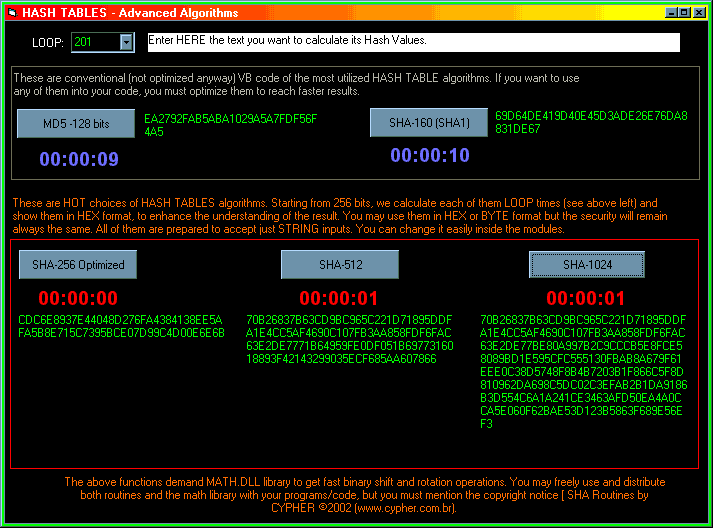



## SHA 256\-512\-1024

### Description

The main purpose of that package is provide some HASH TABLE/Message Digest algorithms to help programmers to calculate digital signatures from strings. Here you can find string-optimized codes to calculate SHA-256, SHA-512 and SHA-1024. Included are non-optimized MD5 and SHA-1 source codes just to get a comparison with the other ones. You may just input any string to get the results (256, 512 or 1024 bits digest).They returns always a string of HEX numbers, representing the bytes of the digest. You may delete the HEX instruction to reach just the bytes themselves. MATH.DLL is included too.

Warning: due to several technical dificulties, the SHA-512 and 1024 versions are customized ones, not the official ones. BUT THEY REALLY WORK as message digest and are serious choice to any data integration routine!

* Get Total Privacy! Get Cypher4 Pro (www.cypher.com.br)
 
### More Info
 

             |
---                |---
**Submitted On**   |2002-07-29 12:34:12
**By**             |[David Svaiter \(Cypher Team\)](https://github.com/Planet-Source-Code/PSCIndex/blob/master/ByAuthor/david-svaiter-cypher-team.md)
**Level**          |Advanced
**User Rating**    |5.0 (30 globes from 6 users)
**Compatibility**  |VB 5\.0, VB 6\.0
**Category**       |[Encryption](https://github.com/Planet-Source-Code/PSCIndex/blob/master/ByCategory/encryption__1-48.md)
**World**          |[Visual Basic](https://github.com/Planet-Source-Code/PSCIndex/blob/master/ByWorld/visual-basic.md)
**Archive File**   |[SHA\_256\-511120337292002\.zip](https://github.com/Planet-Source-Code/david-svaiter-cypher-team-sha-256-512-1024__1-37345/archive/master.zip)

